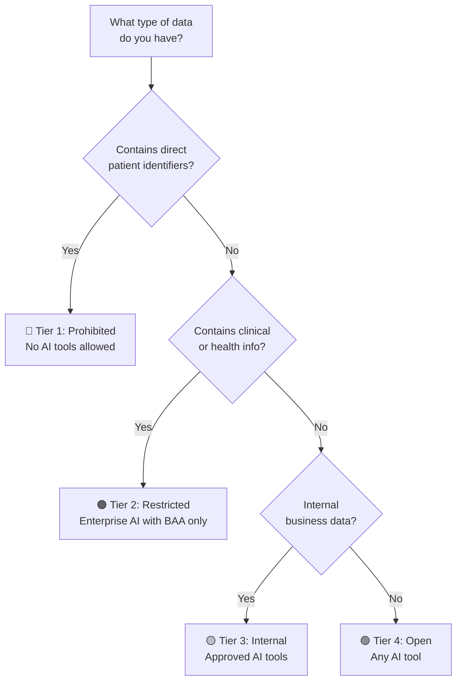
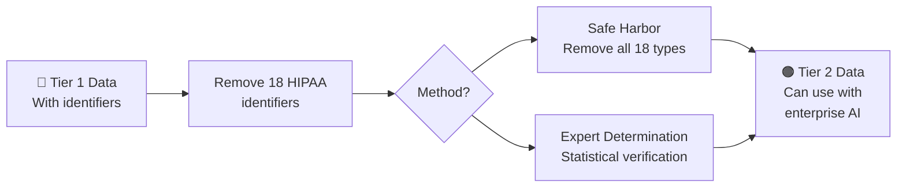

# Data Classification

Every piece of information you consider entering into an AI tool must pass through a classification check first. PurposeMed uses a four-tier system that maps directly to the level of protection required. This system applies across all service lines -- Freddie, Frida, and Foria -- and across all jurisdictions where PurposeMed operates.

Learn it, bookmark it, and consult it every time you are unsure.

---

## The Four Tiers

### Tier 1 -- Prohibited

**Never enter this data into ANY AI tool, including enterprise tools with signed BAAs.**

Tier 1 data includes any information that could, alone or in combination, identify an individual patient:

- Patient names (full or partial)
- Dates of birth
- Health card or insurance numbers
- Social Security Numbers (SSN) or Social Insurance Numbers (SIN)
- Full addresses (street-level or more specific)
- Medical record numbers
- Device identifiers (IMEI, MAC addresses, serial numbers)
- Photographs of patients or their documents
- Any combination of data points that could be used to re-identify a patient, even if each element alone seems harmless

:::danger No exceptions for Tier 1 data
Even if the AI tool has a signed BAA, even if you are the patient's treating clinician, even if you plan to delete the conversation immediately -- Tier 1 data does not go into AI tools. The risk of inadvertent exposure, model training leakage, or regulatory violation is too high.
:::

### Tier 2 -- Restricted

**Only approved enterprise AI tools with a signed BAA.**

Tier 2 data has been stripped of direct identifiers but still carries sensitivity:

- De-identified clinical data (following HIPAA/PIPEDA safe harbor standards)
- Aggregated patient statistics (e.g., "45% of Freddie patients in Ontario renewed PrEP prescriptions in Q3")
- Clinical protocols and treatment guidelines specific to PurposeMed
- Internal policies and procedures that reference clinical workflows
- Financial data that does not contain patient identifiers

You may enter Tier 2 data into tools such as Claude Enterprise, Azure OpenAI Service, or other platforms where PurposeMed has a signed BAA and IT Security has confirmed the configuration meets compliance requirements.

### Tier 3 -- Internal

**Approved AI tools (BAA not required, but tool must be on the approved list).**

Tier 3 data is operationally sensitive but does not involve patient information:

- Company standard operating procedures (SOPs)
- Training materials and onboarding documents
- General clinical references (e.g., publicly available drug interaction databases)
- Marketing copy and brand guidelines
- Administrative templates (meeting agendas, project plans, reporting frameworks)

You still need to use tools that IT Security has reviewed and approved. Consumer ChatGPT or Claude may be on the approved list for Tier 3 work in some organizations, but confirm with your IT Security team before assuming.

### Tier 4 -- Open

**Any AI tool, including consumer-grade products.**

Tier 4 data is already public or carries no organizational sensitivity:

- Publicly available clinical guidelines (e.g., WHO recommendations, CDC treatment protocols)
- General health education content available on public websites
- Grammar and writing assistance for non-sensitive text
- General brainstorming that does not reference PurposeMed operations, patients, or proprietary information

Even with Tier 4 data, exercise professional judgment. If your prompt provides context that could reveal PurposeMed strategy or patient population characteristics, it may belong in a higher tier.

---

## Quick Reference Table

| Tier | Classification | Permitted Tools | Examples |
|---|---|---|---|
| 1 | Prohibited | None | Patient names, DOB, health card numbers, SSN/SIN, addresses, MRN, photos |
| 2 | Restricted | Enterprise AI with signed BAA | De-identified clinical data, aggregated stats, internal protocols, financial data |
| 3 | Internal | Approved AI tools (IT Security reviewed) | SOPs, training materials, clinical references, marketing copy, admin templates |
| 4 | Open | Any AI tool | Public guidelines, health education, grammar help, general brainstorming |

---

## Quick Decision Flow

Before entering any data into an AI tool, walk through these four questions in order:

**Step 1: Does the data contain ANY patient identifiers?**
If yes -- STOP. This is Tier 1 data. Do not enter it into any AI tool. If you need AI assistance with this workflow, de-identify the data first and proceed to Step 2.

**Step 2: Is the data de-identified per HIPAA Safe Harbor or PIPEDA standards?**
If no -- de-identify the data before proceeding. Remove all 18 HIPAA identifiers and ensure the data cannot be re-identified through combination with other available information. If you are unsure whether your de-identification is sufficient, consult your privacy officer.

**Step 3: Does the AI tool have a signed Business Associate Agreement (BAA) with PurposeMed?**
If no -- you may only use Tier 3 or Tier 4 data with this tool. Check the [approved tools list](/governance/shadow-ai-and-approved-tools) to find a BAA-covered alternative for Tier 2 work.

**Step 4: Has IT Security approved this specific tool for use at PurposeMed?**
If no -- submit the tool for approval before using it. Even for Tier 3 and Tier 4 data, unapproved tools create shadow AI risks and may have terms of service that conflict with PurposeMed policies.

:::tip When in doubt, treat data as Tier 1
When in doubt, treat data as Tier 1 (Prohibited). It is always safer to over-protect than under-protect. You can escalate to your privacy officer or the AI Governance Committee for a formal classification ruling.
:::

---

## De-Identification Techniques

When you need to use clinical data with AI tools, proper de-identification is your bridge between Tier 1 (off-limits) and Tier 2 (usable with BAA-covered tools). Two recognized methods exist under HIPAA, and both are accepted practice under PIPEDA.

### Safe Harbor Method

Remove all 18 categories of identifiers defined by HIPAA:

1. Names
2. Geographic data smaller than a state (street address, city, county, ZIP code)
3. All dates directly related to an individual (except year) for ages under 90
4. Phone numbers
5. Fax numbers
6. Email addresses
7. Social Security Numbers
8. Medical record numbers
9. Health plan beneficiary numbers
10. Account numbers
11. Certificate or license numbers
12. Vehicle identifiers and serial numbers
13. Device identifiers and serial numbers
14. Web URLs
15. IP addresses
16. Biometric identifiers
17. Full-face photographs and comparable images
18. Any other unique identifying number, characteristic, or code

After removing these elements, you must also verify that the remaining information cannot be used, alone or in combination, to re-identify an individual.

### Expert Determination Method

A qualified statistical or scientific expert applies accepted methods to determine that the risk of re-identification is very small. This approach is more flexible but requires documented expert analysis.

:::warning Small population sizes increase re-identification risk
PurposeMed serves specialized patient populations. A dataset describing "all Foria patients in [small city] receiving [specific treatment] aged 25-30" may contain so few individuals that even without direct identifiers, the combination of attributes makes re-identification possible. When working with small cohorts, apply extra scrutiny or consult your privacy officer before classifying data as Tier 2.
:::

---

## Further Reading

- [Patient Data and Compliance](/governance/patient-data-and-compliance) -- the regulatory framework underlying this classification system
- [Shadow AI and Approved Tools](/governance/shadow-ai-and-approved-tools) -- how to find and evaluate compliant AI tools for each tier
