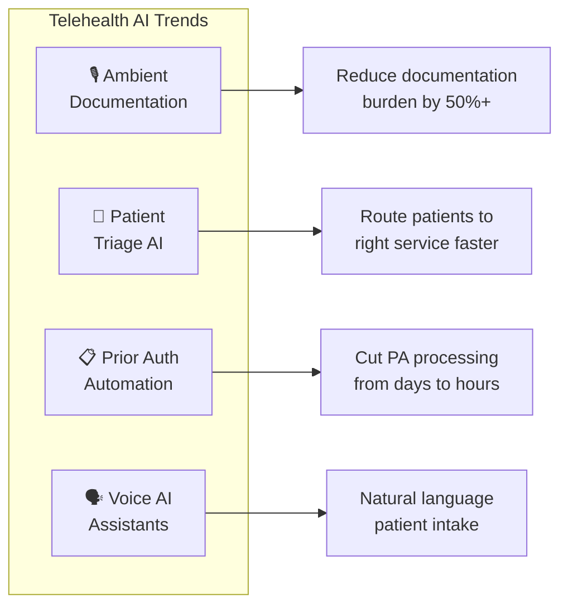

# The Executive Role in AI

AI adoption in healthcare is not an IT initiative. It is a leadership challenge that requires executives to model new behaviors, reshape organizational structures, and make strategic bets on rapidly evolving capabilities. Your role is not to understand every model architecture -- it is to set the conditions for your organization to adopt AI responsibly and effectively.

## Leading by Example

The single most impactful thing you can do as a healthcare executive is to visibly use AI in your own work. When your team sees you drafting communications with Claude, summarizing board materials with Gemini, or analyzing operational data with AI assistance, it signals that these tools are endorsed at the highest level.

**Be visible about your AI use.** Mention it in meetings. Share what worked and what did not. Normalize the learning curve.

**Ask "What did we learn?" not "Did it work?"** Early AI initiatives will produce mixed results. The executive who frames every deployment as a learning opportunity -- rather than a pass/fail test -- creates the psychological safety needed for honest evaluation and rapid iteration.

**Provide guardrails, not rigid plans.** AI capabilities are changing faster than any strategic plan can anticipate. Your job is to define the boundaries (governance, compliance, ethical principles) and let your teams experiment within them. Prescribing specific tools or workflows from the top down will be outdated before the ink dries.

**Focus on uniquely human capabilities.** As AI handles more routine cognitive work, the premium on distinctly human skills -- empathy, clinical judgment, complex decision-making, relationship building -- increases. Your leadership narrative should emphasize augmentation: AI handles the administrative burden so your providers can focus on what they do best.

:::info
The most effective AI leaders are not the most technically fluent. They are the ones who create environments where their teams feel safe to experiment, fail, learn, and iterate.
:::

## The Span of Value

Fifty-six percent of CEOs expect AI to reduce management layers by 2028 (Gartner). This is the wrong framing for healthcare. Rather than eliminating layers, AI increases each manager's **span of value** -- the range of decisions, people, and processes a single leader can effectively oversee.

When AI automates routine reporting, surfaces relevant data proactively, and handles first-pass analysis, a clinical operations director can meaningfully oversee more programs. When AI drafts communications, summarizes meeting notes, and tracks action items, a VP can manage more direct reports without sacrificing quality of oversight.

For PurposeMed, this means your leadership team can scale across three service lines (Freddie, Frida, Foria) and multiple jurisdictions without proportionally growing the management layer. The goal is not fewer managers -- it is more impactful management.

## Telehealth AI Trends to Watch



As a healthcare executive, you need to track the AI capabilities that are reshaping telehealth delivery. These four areas have the most immediate relevance to PurposeMed's operations.

### Ambient Clinical Documentation

Ambient AI documentation tools listen to clinical conversations and generate structured notes in real time. Adoption has been rapid: 62.6% of US hospitals running Epic have adopted ambient documentation capabilities.

**Why it matters for PurposeMed:** Your providers conduct telehealth appointments where documentation competes with patient attention. Ambient scribes reduce clinician burden during virtual visits, allowing providers to maintain eye contact and presence during stigma-sensitive conversations about PrEP, ADHD, and gender-affirming care. The quality of therapeutic alliance in these conversations directly affects outcomes.

### AI Patient Triage

AI-powered triage systems can screen patients for eligibility, assess symptom severity, and route them to appropriate care pathways before they see a provider.

**Relevant applications:**

- **PrEP eligibility screening (Freddie):** AI can assess risk factors and eligibility criteria, reducing the administrative burden on providers and accelerating time to medication.
- **ADHD symptom assessment (Frida):** Structured AI-assisted intake can gather symptom history and severity indicators before the clinical appointment.
- **Gender-affirming care needs assessment (Foria):** AI can guide patients through intake questions in a sensitive, patient-controlled format.

Seventy-five percent of healthcare providers are expected to deploy conversational AI by 2027. Planned Parenthood's Roo chatbot is an instructive model -- it provides stigma-free sexual health information and demonstrates that AI can handle sensitive health topics when designed with the right clinical and cultural input.

:::tip
When evaluating AI triage tools for stigma-sensitive populations, prioritize tools that give patients control over the pace and depth of disclosure. A rigid screening questionnaire feels like interrogation. A conversational interface feels like support.
:::

### Prior Authorization Automation

Prior authorization is one of the highest-friction administrative processes in healthcare. The CMS Final Rule effective January 2026 requires payers to respond to urgent prior authorization requests within 72 hours, creating both a mandate and an opportunity for automation.

**Expected impact:**

- 60% reduction in prior authorization processing time
- 35% decrease in administrative costs associated with PA workflows

For PurposeMed, where patients are accessing medications that often require PA (PrEP, stimulant medications for ADHD, hormone therapy), automating the PA workflow directly impacts time-to-treatment. Every day a patient waits for PA approval is a day without medication.

### Voice AI

Voice AI encompasses automated appointment reminders, follow-up calls, medication adherence check-ins, and symptom monitoring through phone-based interactions. Sixty-three percent of US healthcare organizations are now using voice AI in some capacity.

**Proven impact:** Voice AI-based appointment reminders reduce no-shows by 25-30%. For a telehealth provider like PurposeMed, where no-shows directly reduce revenue and disrupt care continuity, this is one of the highest-ROI AI applications available.

:::warning
Voice AI for medication adherence reminders in stigma-sensitive care requires careful design. A reminder about "your PrEP medication" reaching the wrong listener could have consequences for the patient. Ensure voice AI systems support patient-configured privacy preferences.
:::

## Your 90-Day AI Leadership Plan

```mermaid
timeline
    title 90-Day AI Leadership Plan
    section Days 1-7 : Personal Onboarding
        Set up Claude and Gemini : Complete first real tasks
        Share experience publicly
    section Days 8-30 : Team Foundation
        Launch pilot group : Establish success metrics
        First training session
    section Days 31-60 : Expand and Measure
        Department-wide rollout : Measure initial ROI
        Share early wins
    section Days 61-90 : Institutionalize
        Form governance committee : Publish approved tools list
        Celebrate successes
```

This plan gives you a structured path from personal AI adoption to organizational scale. Adapt the timeline to your context, but resist the temptation to skip the early steps -- your credibility as an AI leader depends on your own fluency.

### Days 1-7: Personal Setup

- Choose your primary AI tool (Claude or Gemini, based on your workflow) and set up your account
- Complete your first real work task with AI assistance: summarize a report, draft a communication, or analyze a dataset
- Identify one recurring personal workflow that AI could improve

**Goal:** You can articulate from personal experience what AI does well and where it falls short.

### Days 8-30: Team Pilot

- Select one team and one workflow for a structured AI pilot
- Establish baseline metrics for the selected workflow (time, quality, volume)
- Form your AI Governance Committee (or add AI governance to an existing committee's mandate)
- Define clear success criteria and a decision date for the pilot

**Goal:** One team is actively using AI with measurable results, and governance is in place.

### Days 31-60: Department-Wide Automation

- Expand the pilot to the full department based on pilot results
- Establish your metrics baseline across all four ROI domains (see [Measuring AI ROI](/leadership/measuring-ai-roi))
- Begin training for all department staff, not just pilot participants
- Identify the next two to three workflows for AI automation

**Goal:** AI use is normalized within one department, and you have a repeatable playbook for expansion.

### Days 61-90: Scale and Measure

- Launch AI initiatives in additional departments or service lines
- Conduct your first formal ROI assessment against baseline metrics
- Share results transparently with the full leadership team -- both wins and gaps
- Set targets for the next quarter based on data, not assumptions

**Goal:** AI is delivering measurable value, leadership is aligned, and you have a data-driven plan for continued scaling.

:::danger
Do not skip Days 1-7. Executives who delegate their own AI learning to their teams lose the credibility needed to drive adoption. You do not need to become an expert, but you do need to be a practitioner.
:::
