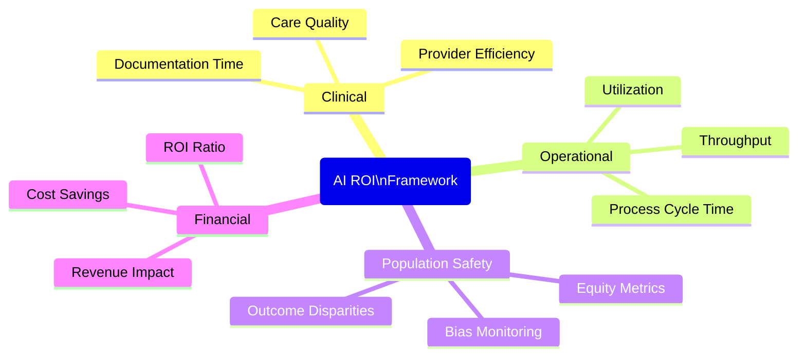

# Measuring AI ROI

Proving the value of AI investments requires more than anecdotal wins. You need a structured framework that connects AI initiatives to clinical outcomes, operational gains, and financial performance -- especially in a cross-border telehealth environment where each service line (Freddie, Frida, Foria) serves distinct patient populations with unique care pathways.

## The Four-Domain ROI Framework

Effective AI measurement spans four interconnected domains. Tracking only one (typically cost savings) gives you an incomplete and often misleading picture.

### 1. Clinical Impact

Clinical impact measures whether AI is improving the quality of care your patients receive.

**Key metrics:**

- **Clinical outcome improvements** -- Are patients achieving better health outcomes (e.g., viral suppression rates for Freddie patients on PrEP, symptom management scores for Frida ADHD patients)?
- **Diagnostic and recommendation accuracy** -- When AI assists with triage or clinical decision support, how often does it align with clinician judgment?
- **Adverse event reduction** -- Are AI-assisted workflows catching medication interactions, contraindications, or documentation errors before they reach patients?
- **Documentation completeness** -- Are AI-drafted notes more thorough and consistent than manual documentation?

:::info
For PurposeMed, clinical impact metrics should be separated by service line. A PrEP adherence improvement in Freddie has different clinical significance than an HRT dosing accuracy improvement in Foria.
:::

### 2. Operational Efficiency

Operational efficiency measures whether AI is helping your teams do more with less friction.

**Key metrics:**

- **Throughput** -- Appointments completed per provider per day, referrals processed per week
- **Time savings** -- Minutes saved per encounter on documentation, administrative tasks, or prior authorization
- **Automation rates** -- Percentage of routine tasks (scheduling confirmations, follow-up reminders, intake form processing) handled without human intervention
- **Cycle time reduction** -- Time from patient request to resolution for common workflows

### 3. Population-Level Safety

Population-level safety ensures your AI tools are performing equitably across all patient groups.

**Key metrics:**

- **Bias monitoring** -- Are AI recommendations consistent across demographics, geographies, and service lines?
- **Equity audits** -- Do patients accessing care through Freddie, Frida, and Foria receive equivalent quality of AI-assisted service regardless of location or background?
- **Error rate distribution** -- Are AI errors concentrated in specific patient populations or care contexts?
- **Regulatory compliance** -- Are outputs meeting HIPAA, PIPEDA, and provincial regulatory requirements across all jurisdictions you serve?

:::warning
Bias monitoring is not optional for stigma-sensitive care. PrEP eligibility screening, ADHD assessment support, and gender-affirming care recommendations each carry population-specific risks that must be tracked independently.
:::

### 4. Financial Performance

Financial performance connects AI investments to the bottom line.

**Key metrics:**

- **Cost reduction** -- Direct savings from automation, reduced rework, and fewer manual processes
- **Revenue recovery** -- Captured revenue from reduced no-shows, faster prior authorizations, and improved appointment completion
- **Margin improvement** -- Cost per interaction trending downward while quality metrics hold steady or improve
- **Implementation cost vs. return timeline** -- How quickly are AI investments paying for themselves?

## Real-World Benchmarks

These benchmarks from published healthcare AI deployments give you reference points for setting your own targets.

| Organization | AI Application | Result |
|---|---|---|
| UW Health | Ambient clinical documentation | 30 minutes per day reduction in documentation time per provider |
| Riverside Health | AI-assisted clinical workflows | 11% increase in physician work RVUs |
| Nebraska Medicine | Predictive analytics for discharge planning | 5% reduction in length of stay, equivalent to freeing 37 beds |
| Healthcare AI (industry composite) | Multi-domain AI deployment | $3.20 return per $1 invested within 14 months |

:::tip
Use these benchmarks as conversation starters, not targets. Your results will vary based on baseline efficiency, team adoption, and workflow complexity. The important thing is to establish your own baseline before deployment and measure consistently afterward.
:::

## Key Metrics for PurposeMed

Given PurposeMed's cross-border telehealth model and three distinct service lines, your AI ROI dashboard should track these metrics, broken out by Freddie, Frida, and Foria where applicable.

### Provider Experience

| Metric | What to Measure | Why It Matters |
|---|---|---|
| Documentation time | Minutes per encounter spent on notes | Direct indicator of AI scribe and template effectiveness |
| Appointment completion rate | Percentage of scheduled appointments completed | Measures whether AI-assisted scheduling and reminders reduce drop-off |
| Burnout indices | Standardized burnout survey scores (e.g., Maslach Burnout Inventory) | Sustained provider wellbeing is a leading indicator of retention and care quality |

### Patient Experience

| Metric | What to Measure | Why It Matters |
|---|---|---|
| Patient satisfaction scores | Post-visit surveys, particularly for stigma-sensitive interactions | AI should enhance, not diminish, the patient experience in sensitive care contexts |
| Medication adherence | PrEP adherence (Freddie), HRT adherence (Foria), ADHD medication adherence (Frida) | Adherence is the primary clinical outcome for all three service lines |
| Time to care | Days from initial inquiry to first appointment | AI triage and intake automation should compress this |

### Administrative Efficiency

| Metric | What to Measure | Why It Matters |
|---|---|---|
| Prior authorization processing time | Hours from submission to resolution | PA delays directly impact patient access to care |
| Cost per interaction | Fully loaded cost per patient encounter | The core unit economics metric for telehealth |
| Automation rate | Percentage of administrative tasks completed without human intervention | Indicates maturity of your AI deployment |

### Measuring by Service Line

Each PurposeMed service line has different baseline metrics and improvement potential:

- **Freddie (HIV/PrEP):** Focus on PrEP adherence tracking, eligibility screening accuracy, and follow-up completion rates. Stigma sensitivity in AI-generated communications is a critical quality metric.
- **Frida (ADHD):** Focus on assessment throughput, medication management efficiency, and follow-up scheduling. Documentation time savings are typically highest here due to structured assessment protocols.
- **Foria (Gender-Affirming Care):** Focus on intake-to-care time, HRT monitoring compliance, and patient-reported experience. Privacy and sensitivity in all AI-generated content requires its own quality audit.

:::danger
Never aggregate service line metrics into a single number for executive reporting without also showing the per-line breakdown. A strong result in one line can mask underperformance in another, and each line serves a population with distinct needs and risks.
:::

## Building Your ROI Dashboard

**Step 1: Establish baselines.** Before deploying any AI tool, measure your current state for every metric you plan to track. Without baselines, you cannot demonstrate improvement.

**Step 2: Set targets by domain.** Use the four-domain framework to set balanced targets. Optimizing only for financial performance at the expense of clinical quality or equity is not acceptable in healthcare.

**Step 3: Measure at consistent intervals.** Monthly for operational and financial metrics. Quarterly for clinical outcomes and population safety. Annually for comprehensive ROI calculation.

**Step 4: Report transparently.** Share both wins and shortfalls with your leadership team. AI ROI measurement is an ongoing discipline, not a one-time justification exercise.
