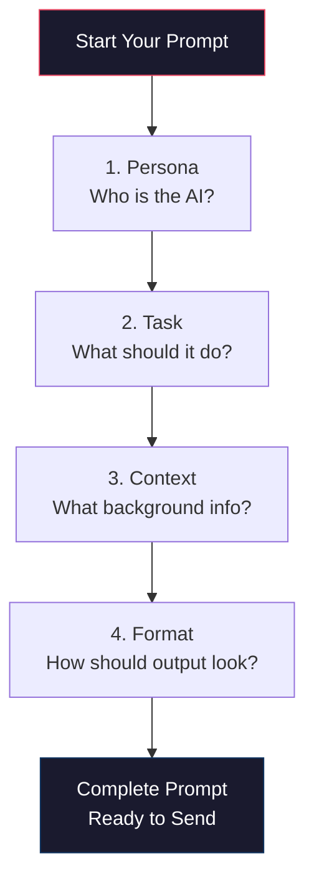
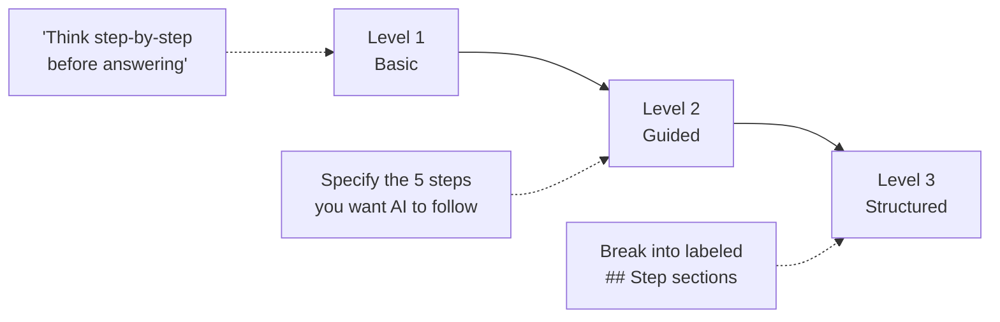

# Anatomy of a Great Prompt

The difference between a mediocre AI output and a genuinely useful one almost always comes down to the prompt. This page gives you a repeatable formula you can apply to any task, whether you are drafting a board memo, analyzing patient acquisition costs, or writing a job description.

---

## The Four-Component Prompt Formula

Every high-quality prompt contains four components. You do not need to label them explicitly, but you should make sure each one is present.

| Component | What It Does | Example |
|-----------|-------------|---------|
| **Persona** | Tells the AI who to be | "You are a healthcare compliance analyst with expertise in Canadian privacy law." |
| **Task** | States exactly what you need | "Review the attached policy and identify gaps against PIPEDA requirements." |
| **Context** | Provides the background the AI needs | "PurposeMed operates telehealth services across Canadian provinces (Freddie for HIV/PrEP, Frida for ADHD, Foria for gender-affirming care)." |
| **Format** | Describes how the output should look | "Return a table with columns: Requirement, Current Status, Gap, Recommendation." |



### Before and After

**Vague prompt:**

```text
Help me write an email about our new service.
```

This gives the AI almost nothing to work with. You will get a generic, unusable draft.

**Structured prompt using the four components:**

```text
Persona: You are a healthcare marketing specialist who writes patient-facing
communications for telehealth companies.

Task: Draft an announcement email introducing Foria, our new gender-affirming
care service line, to existing patients on the Freddie and Frida platforms.

Context: PurposeMed serves patients across Canada. Our brand voice is warm,
inclusive, and medically credible. Many of our patients face stigma in
traditional healthcare settings. Foria offers hormone therapy consultations,
lab monitoring, and ongoing care management via telehealth.

Format: Subject line + email body (under 250 words). Use short paragraphs.
Include a single call-to-action linking to the Foria landing page.
```

The structured version produces a draft you can actually send with light editing, rather than a draft you need to rewrite from scratch.

---

## Chain-of-Thought Prompting



When you need the AI to reason through a complex problem rather than jump to a conclusion, ask it to show its work. There are three levels of chain-of-thought prompting.

### Level 1 -- Basic

Add a single line to your prompt:

```text
Think step-by-step before giving your final answer.
```

This is the simplest approach and works surprisingly well for straightforward analytical tasks.

### Level 2 -- Guided

Specify the reasoning stages you want the AI to follow:

```text
Before answering, work through the following steps:
1. Identify the relevant regulatory frameworks (PIPEDA, PHIPA, HIPAA)
2. List the specific requirements that apply to this scenario
3. Evaluate our current practices against each requirement
4. Flag any gaps or risks
5. Provide your recommendations in priority order
```

This is more effective when you know the domain well enough to define the right reasoning path.

### Level 3 -- Structured

Break your prompt into labeled sections so the AI treats each phase as a distinct step:

```text
## Step 1: Situation Analysis
Summarize the current state of our patient acquisition funnel for Freddie.

## Step 2: Benchmarking
Compare our metrics to industry benchmarks for direct-to-consumer telehealth.

## Step 3: Root Cause Analysis
Identify the most likely reasons for drop-off between consultation booking
and prescription fulfillment.

## Step 4: Recommendations
Provide 3-5 actionable recommendations ranked by expected impact.
```

:::tip When to use each level
Use **Level 1** for quick analyses. Use **Level 2** when you want the AI to follow a specific methodology. Use **Level 3** for complex, multi-phase work where each section builds on the previous one.
:::

---

## The Power of Clarifying Questions

One of the most underused techniques is telling the AI to ask *you* questions before it responds. This produces dramatically better outputs because it forces the AI to surface assumptions you may not have considered.

Add this to any prompt:

```text
Before drafting your response, identify any ambiguous aspects of this request.
Ask me up to 3 clarifying questions that would help you produce a significantly
better result. Wait for my answers before proceeding.
```

### Why this works

When you prompt without this technique, the AI silently fills in gaps with assumptions -- assumptions that may be wrong. By asking it to surface those gaps, you get to correct course before any work is wasted.

**Example in practice:**

You ask the AI to draft a board update on patient growth. Without clarifying questions, it might assume you want all three service lines, the last quarter only, and a narrative format. With clarifying questions, it might ask:

1. "Should I focus on all three service lines (Freddie, Frida, Foria) or a specific one?"
2. "What time period should I cover -- last quarter, YTD, or trailing twelve months?"
3. "Is this for an investor-facing board or an internal advisory board? The level of financial detail would differ."

Those three questions save you an entire round of revision.

:::info
This technique is especially valuable when delegating tasks to AI that you would normally explain verbally to a colleague. The back-and-forth mimics the natural clarification process that happens in human conversations.
:::

---

## Common Mistakes to Avoid

| Mistake | Why It Hurts | Fix |
|---------|-------------|-----|
| No persona | AI defaults to a generic assistant | Add a one-line role definition |
| Vague task | AI guesses what you want | Be specific about the deliverable |
| Missing context | AI fills gaps with wrong assumptions | Include relevant background |
| No format spec | Output is unstructured | Describe the exact structure you need |
| Over-constraining | Output feels robotic and narrow | Give the AI room within your constraints |

---

## Try It Now

Pick a task you completed this week -- a memo you wrote, an analysis you ran, a communication you drafted. Now rewrite the prompt you *would have used* following the four-component formula:

```text
Persona: [Who should the AI be?]

Task: [What exactly do you need?]

Context: [What background does the AI need to do this well?]

Format: [How should the output be structured?]
```

Compare the output to what you actually produced. In most cases, the structured prompt will get you 80% of the way to a finished deliverable on the first attempt.
