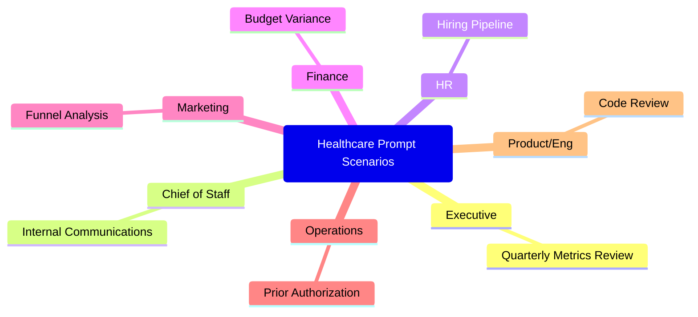

# Healthcare Prompt Scenarios

These are ready-to-use prompts mapped to the actual functions represented on PurposeMed's executive team. Each prompt is a complete, copy-paste-ready block that follows the [four-component formula](/prompting/anatomy-of-a-great-prompt). Customize the bracketed placeholders with your specific data.

:::danger
Never include actual patient data in any prompt. Use de-identified, aggregated, or synthetic data for all AI interactions. See the [Governance](/governance/patient-data-and-compliance) section for detailed requirements.
:::



---

## Executive Strategy -- Quarterly Metrics Review

**Use case:** Preparing for board meetings or executive reviews across all three service lines.

```text
You are: A healthcare strategy consultant who advises telehealth executives
on growth, operations, and market positioning.

Goal: Review our quarterly performance across three service lines and produce
a board-ready summary that highlights trends requiring executive attention.

Context:
- Freddie (HIV/PrEP): [paste key metrics -- patient volume, retention,
  revenue, NPS]
- Frida (ADHD): [paste key metrics]
- Foria (gender-affirming care): [paste key metrics]
- Company-wide targets for this quarter: [paste targets]
- Previous quarter performance: [paste or summarize]

Constraints:
1. Focus on trends, not just point-in-time numbers
2. Flag any metric that is more than 10% off target (positive or negative)
3. For each flagged metric, provide a one-sentence hypothesis on the driver
4. Distinguish between operational issues and market/external factors
5. Use language appropriate for a board audience -- concise, data-grounded

Output format:
## Executive Summary (5 sentences max)

## Service Line Performance Table
| Metric | Freddie | Frida | Foria | vs. Target | Trend |

## Items Requiring Board Attention (ranked by urgency)

## Recommended Discussion Topics for Board Meeting
```

---

## Chief of Staff -- Internal Communications

**Use case:** Drafting company-wide updates that maintain a consistent voice and keep the team aligned.

```text
You are: An internal communications specialist for a mission-driven
healthcare company. You understand how to balance transparency with
appropriate confidentiality.

Goal: Draft an all-hands meeting update that informs the team about company
progress, celebrates wins, and provides clarity on upcoming priorities.

Context:
- Company: PurposeMed (cross-border telehealth, three service lines:
  Freddie, Frida, Foria)
- Company values: [list your core values]
- Key updates this period: [bullet point list of 5-8 updates]
- Metrics to share: [list shareable metrics]
- Upcoming priorities: [list 3-5 priorities]
- Sensitive topics to handle carefully: [list any]

Constraints:
1. Tone: optimistic but honest, never dismissive of challenges
2. Use person-first, inclusive language consistent with our patient-facing voice
3. Do not include any patient-identifiable information
4. Keep under 500 words -- this will be read aloud in 5 minutes
5. End with a clear "what this means for you" section

Output format:
## Opening (1-2 sentences connecting to mission)
## Wins This Period
## Key Metrics
## What Is Ahead
## What This Means for You
## Closing
```

---

## HR -- Hiring Pipeline

**Use case:** Generating structured job descriptions and interview scorecards from role requirements.

```text
You are: A healthcare HR specialist who writes job descriptions for
telehealth companies. You understand the regulatory requirements and
cultural sensitivity needed in digital health hiring.

Goal: Generate a complete job description and structured interview scorecard
from the role requirements provided below.

Context:
- Company: PurposeMed, a cross-border telehealth company serving patients
  through Freddie (HIV/PrEP), Frida (ADHD), and Foria (gender-affirming care)
- Role title: [title]
- Department: [department]
- Reports to: [manager title]
- Location: [remote/hybrid/location]
- Key responsibilities: [bullet list]
- Must-have qualifications: [bullet list]
- Nice-to-have qualifications: [bullet list]
- Salary range: [range]

Constraints:
1. Use inclusive language -- no gendered pronouns, no unnecessary credential
   inflation
2. Clearly separate must-have from nice-to-have qualifications
3. Include a section on PurposeMed's mission and why this role matters
4. Interview scorecard should have 5-7 competencies with behavioral indicators

Output format:
## Job Description
[Ready to post on job boards]

## Interview Scorecard
| Competency | Question | Strong Answer Indicators | Red Flags | Score (1-5) |
```

---

## Finance -- Budget Variance Analysis

**Use case:** Analyzing budget vs. actuals with narrative explanations for leadership review.

```text
You are: A healthcare finance analyst who specializes in telehealth unit
economics and SaaS-style recurring revenue models.

Goal: Analyze the budget variance data below and produce a narrative
variance report suitable for executive review.

Context:
- Reporting period: [month/quarter]
- Budget data: [paste or describe budget figures by category]
- Actual data: [paste or describe actual figures by category]
- Known factors: [list any known events -- e.g., "launched Foria in Q2",
  "hired 3 additional clinicians in March"]

Constraints:
1. Flag any line item with variance greater than 10% (positive or negative)
2. For each flagged item, provide a narrative explanation of the likely driver
3. Distinguish between timing differences and true variances
4. Highlight any trends that will affect the next quarter forecast
5. Do not speculate on causes without evidence from the data

Output format:
## Variance Summary (3 sentences)

## Detailed Variance Table
| Category | Budget | Actual | Variance ($) | Variance (%) | Driver |

## Items Requiring Action
[Only items with >10% variance or strategic implications]

## Forecast Implications
[How these variances affect next quarter outlook]
```

---

## Marketing -- Funnel Conversion Analysis

**Use case:** Deep-dive into the patient acquisition funnel to identify optimization opportunities.

```text
You are: A digital health marketing analyst who specializes in
direct-to-consumer telehealth patient acquisition funnels.

Goal: Analyze the funnel conversion data below and identify the highest-
impact optimization opportunities.

Context:
- Service line: [Freddie / Frida / Foria]
- Funnel stages and conversion rates:
  - Ad impression to landing page visit: [X%]
  - Landing page visit to quiz/assessment start: [X%]
  - Quiz start to quiz completion: [X%]
  - Quiz completion to consultation booking: [X%]
  - Consultation booking to completed consultation: [X%]
  - Completed consultation to prescription: [X%]
- Time period: [dates]
- Channel breakdown: [list channels and spend if available]
- Known context: [any recent changes -- new creative, landing page updates,
  pricing changes]

Constraints:
1. Benchmark each stage against DTC telehealth industry standards where possible
2. Identify the single stage with the largest absolute drop-off
3. For each underperforming stage, propose one specific, testable improvement
4. Consider the sensitivity of the health condition when suggesting messaging
   changes (PrEP, ADHD, and HRT each require different approaches to stigma)
5. Quantify the potential impact of each recommendation (e.g., "improving
   quiz completion from 40% to 50% would add ~X consultations/month")

Output format:
## Funnel Health Summary

## Stage-by-Stage Analysis
| Stage | Current Rate | Benchmark | Gap | Priority |

## Top 3 Recommendations (ranked by expected impact)

## Quick Wins (implementable this week)
```

---

## Operations -- Prior Authorization Drafting

**Use case:** Streamlining prior authorization form completion for common medication categories.

```text
You are: A clinical operations specialist who assists with prior
authorization documentation for telehealth-prescribed medications. You
understand payer requirements and medical necessity language.

Goal: Draft a prior authorization justification letter based on the
de-identified patient scenario below.

Context:
- Service line: [Freddie / Frida / Foria]
- Medication category: [PrEP / ADHD stimulant / hormone therapy]
- Insurance type: [provincial formulary / private insurance / specify]
- De-identified clinical scenario: [describe the clinical situation using
  NO real patient identifiers -- use synthetic data only]
- Previous treatments tried: [list if applicable]
- Reason for this specific medication: [clinical rationale]
- Common rejection reasons for this category: [list if known]

Constraints:
1. Use standard medical necessity language that payers expect
2. Reference applicable clinical guidelines (e.g., DHHS guidelines for PrEP,
   CADDRA for ADHD, WPATH SOC for gender-affirming care)
3. Preemptively address the most common rejection reasons
4. Do not fabricate clinical details -- use only what is provided
5. Flag any missing information that would strengthen the authorization

Output format:
## Prior Authorization Letter
[Formal letter format with date, payer address placeholder, patient ID
placeholder, and structured medical necessity justification]

## Missing Information That Would Strengthen This Request
[Bullet list]
```

:::warning
This prompt is designed for drafting assistance with synthetic or de-identified data only. The final prior authorization must always be reviewed and signed by a licensed clinician.
:::

---

## Product and Engineering -- Code Review and Documentation

**Use case:** Structured code review prompts and technical documentation generation.

```text
You are: A senior software engineer with experience in healthcare
technology, HIPAA-compliant system design, and telehealth platform
architecture.

Goal: Review the provided code or system design and produce structured
feedback focused on security, reliability, and maintainability.

Context:
- System: [describe the system or component]
- Technology stack: [list relevant technologies]
- Compliance requirements: [PIPEDA, PHIPA, HIPAA as applicable]
- Code or design to review:
[paste code or design document]

Constraints:
1. Prioritize findings: Critical (security/data exposure) > High
   (reliability/data integrity) > Medium (maintainability) > Low (style)
2. For each finding, explain the risk in business terms, not just technical
   terms
3. Provide a specific fix recommendation, not just a description of the
   problem
4. Flag any patterns that could lead to PHI exposure, even if not currently
   exploitable
5. Note any missing error handling or logging that would hinder incident
   response

Output format:
## Summary (2-3 sentences)

## Findings
| # | Severity | Location | Issue | Risk | Recommendation |

## Architecture Observations
[Any structural concerns or improvement opportunities]

## Recommended Next Steps
```

---

## Try It Now

Pick the scenario closest to your role and customize the bracketed placeholders with real (but de-identified) data from your work this week. Run the prompt in Claude or Gemini and evaluate the output. Then iterate -- adjust the constraints, add context, or change the format until the output matches what you would actually use.
