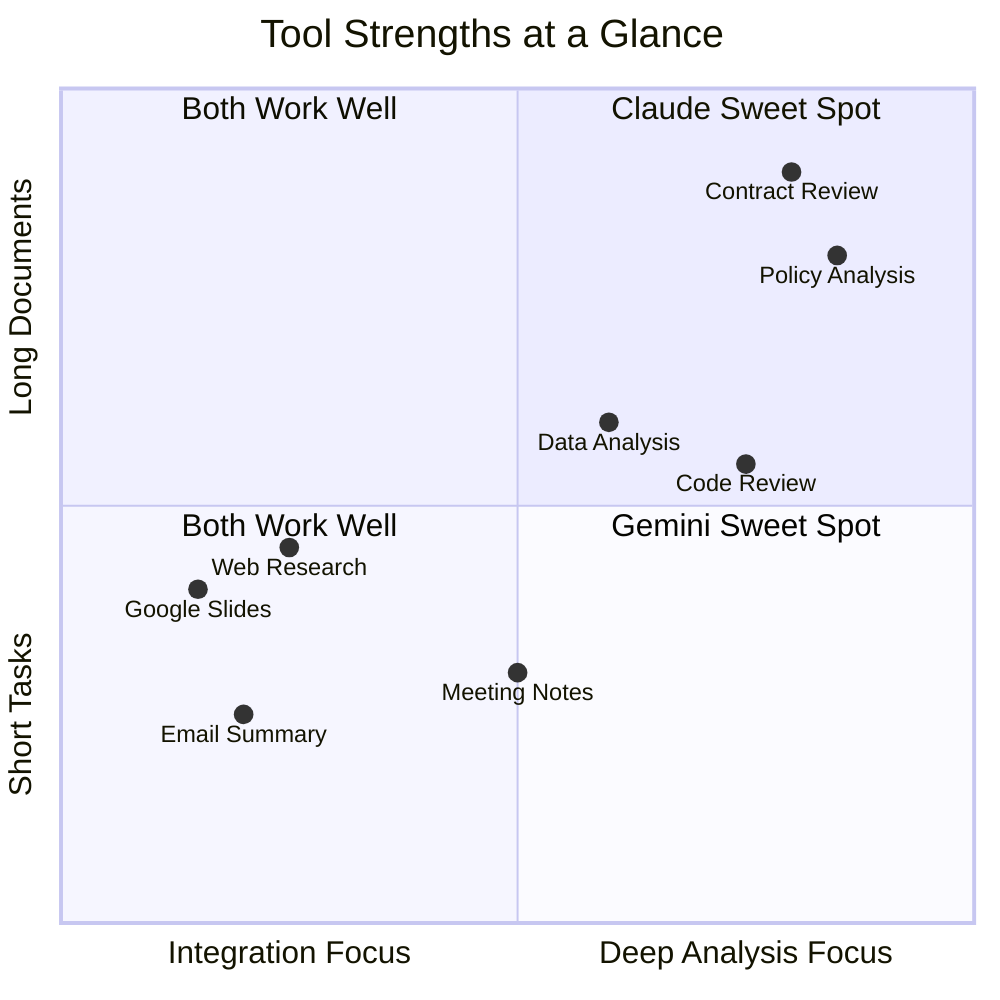

# Your AI Toolkit

The right tool for the right job. This page covers PurposeMed's recommended AI tools, their strengths, and when to use each one.

---

## Claude by Anthropic

Claude is exceptional at analysis, writing, coding, and reasoning through complex problems. It handles long documents well -- up to 200K tokens of context, which means you can paste an entire policy manual or regulatory filing and ask questions about it.

**Claude Projects** lets you create persistent workspaces where you upload reference documents, set custom instructions, and maintain context across multiple conversations. This is particularly valuable for ongoing work like Freddie's compliance documentation or Frida's clinical protocol reviews.

**Best for:**

- Analyzing regulatory documents (PIPEDA, PHIPA, HIPAA)
- Drafting patient communications and internal policies
- Reviewing and summarizing long reports or contracts
- Building structured workflows and templates
- Coding and technical problem-solving

---

## Google Gemini

Gemini's core strength is its deep integration with Google Workspace. It works natively inside Gmail, Google Docs, Sheets, Slides, Drive, and Calendar -- which means it can read your existing documents and act on them without copy-pasting.

Gemini Pro offers a 2M token context window and real-time web search grounding, so its responses can reference current information rather than relying solely on training data. **Gemini Gems** let you create persistent custom assistants with specific instructions and personality, similar to Claude Projects.

**Best for:**

- Summarizing email threads and drafting replies in Gmail
- Creating and formatting Google Slides presentations
- Analyzing data in Google Sheets with natural language queries
- Real-time research with live web search
- Multimodal tasks involving images, video, or audio

---

## When to Use Which

| Task | Recommended Tool | Why |
|---|---|---|
| Analyzing regulatory documents | Claude | Superior reasoning, handles long documents precisely |
| Summarizing emails in Gmail | Gemini | Native Gmail integration, no copy-pasting needed |
| Drafting patient communications | Claude | Better instruction-following for tone and style constraints |
| Creating Google Slides presentations | Gemini | Native Slides integration, direct editing |
| Building automation workflows | Claude | Stronger structured and technical output |
| Real-time competitive research | Gemini | Live web search grounding with current results |
| Reviewing a 100-page contract | Claude | 200K context window with precise retrieval |
| Organizing Google Drive files | Gemini | Native Drive integration |
| Writing prior auth templates for Freddie | Claude | Consistent formatting with complex constraints |
| Summarizing a Google Meet recording | Gemini | Native Meet integration and transcription |

---

## What About ChatGPT?

Many of you already use ChatGPT -- the survey showed it is one of the most popular tools on the team. It works well for general tasks and has a strong ecosystem of plugins and integrations.

Claude and Gemini are recommended as your primary tools because they offer enterprise compliance features that are important for healthcare: stronger data handling commitments, SOC 2 compliance, and contractual guarantees around data retention that align with PurposeMed's obligations under PIPEDA and HIPAA. You do not need to stop using ChatGPT for non-sensitive work, but be intentional about which tool you reach for when patient data or proprietary information is involved.

:::warning
Never use consumer AI tools with patient data, protected health information, or personally identifiable information. This includes free tiers of any AI tool that may use your inputs for training. See the [Governance](/governance/patient-data-and-compliance) section for approved tools and data classification guidelines.
:::
